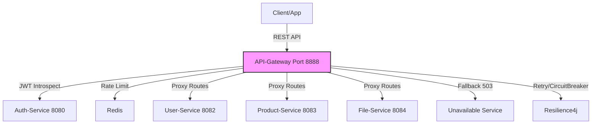

# API-Gateway - Lớp Routing & Bảo Mật

[](https://github.com/shopping-ecommerce/api-gateway/actions) [](https://codecov.io/gh/shopping-ecommerce/api-gateway) [](LICENSE) [](https://spring.io/projects/spring-boot) [](https://openjdk.org/)

## 📋 Mô Tả
API-Gateway là một microservice gateway sử dụng **Spring Cloud Gateway** để routing requests đến các service backend (auth, profiles, notify, user, product, file, etc.) với prefix `/shopping/api`. Xây dựng bằng **Spring Boot 3.x**, tích hợp authentication filter (introspect JWT token qua Auth-Service), rate limiting (Redis, 10 req/s, burst 20), CORS (cho localhost:5173/3000), retry (3 lần), và circuit breaker (Resilience4j, 50% failure threshold). Hỗ trợ fallback (503 cho unavailable services), và public endpoints (không auth cho download, search).

Dự án tập trung vào bảo mật (JWT validation), reliability (retry/DLT, circuit breaker), và scalability (Redis rate limit, concurrent handling).

### 🏗️ Architecture
Kiến trúc gateway pattern với API-Gateway làm entry point. Các thành phần chính:
- **Routing**: Proxy to services (e.g., /profiles/** → user-service:8082).
- **Security**: AuthFilter (introspect token, public endpoints like /profiles/create).
- **Resilience**: Retry (3x, backoff 50-500ms), CircuitBreaker (sliding window 100, 20s open).
- **Rate Limiting**: Redis (ip-based, 10/s, burst 20).
- **Deployment**: Docker + Kubernetes (giả định), port 8888.


## ✨ Tính Năng Chính
- **Routing**: Proxy requests với strip-prefix (e.g., /shopping/api/profiles/** → /profiles/** on user-service).
- **Authentication**: GlobalFilter introspect JWT (public: /profiles/create, /product/searchByProduct/**, /file/media/download/**, etc.).
- **Rate Limiting**: IP-based (10 req/s, burst 20, Redis).
- **CORS**: Allowed origins (localhost:5173/3000), methods (GET/POST/etc.), headers (*).
- **Resilience**: Retry (3 lần, backoff), CircuitBreaker (50% failure, 20s open).
- **Fallback**: 503 responses cho unavailable services (auth/profiles/files/notification).
- **Monitoring**: Health/Info endpoints, logging (DEBUG cho Gateway).

## 🛠️ Tech Stack
| Component          | Technology                  | Details                                      |
|--------------------|-----------------------------|----------------------------------------------|
| **Language/Framework** | Java 17+ / Spring Boot 3.x | Spring Cloud Gateway, WebClient, Security    |
| **Routing/Security** | Spring Cloud Gateway        | Routes, GlobalFilter (Auth), CORS            |
| **Rate Limiting**  | Spring Cloud Gateway + Redis| IP resolver, 10/s burst 20                   |
| **Resilience**     | Resilience4j                | CircuitBreaker (50% threshold, 20s open), Retry (3x) |
| **Cache/Store**    | Redis                       | Rate limiting, StringRedisTemplate           |
| **Client**         | WebClient + HttpServiceProxy| AuthenticationClient (introspect token)      |
| **Utils**          | Lombok, Jackson             | DTOs (ApiResponse), logging (DEBUG)          |

## 🚀 Cài Đặt & Chạy
### Yêu Cầu
- Java 17+ / Maven 3.6+.
- Docker (cho Redis).
- Environment vars: AUTH_URL (http://auth-service:8080), USER_URL (http://user-service:8082), etc. (xem application.yml).

### Bước 1: Clone Repo
```bash
git clone https://github.com/shopping-ecommerce/api-gateway.git
cd api-gateway
```

### Bước 2: Setup Môi Trường
```bash
# Copy env files (nếu có example)
cp src/main/resources/application.yml.example application.yml

# Build project
mvn clean install

# Setup Docker services (Redis)
docker-compose up -d  # Sử dụng docker-compose.yml nếu có
```

### Bước 3: Chạy Service
```bash
# Run với Maven
mvn spring-boot:run

# Hoặc JAR
java -jar target/api-gateway-*.jar
```

- Port mặc định: **8888** (base: /shopping/api, e.g., http://localhost:8888/shopping/api/profiles/create).
- Test routing: curl http://localhost:8888/shopping/api/profiles/create → proxies to user-service.

### Bước 4: Test & Debug
```bash
# Run tests
mvn test

# Check logs (DEBUG cho Gateway/CORS)
tail -f logs/application.log  # Hoặc console
```

- Public: /shopping/api/product/searchByProduct/** (no auth).
- Auth: Most routes (introspect token).

## 📚 Tài Liệu
- **API Docs**: SpringDoc OpenAPI (Swagger UI tại `/swagger-ui.html`).
- **Routes** (base: /shopping/api):
  | Route ID          | Path Prefix                  | Target Service                  |
  |-------------------|------------------------------|---------------------------------|
  | auth-service      | /authentication/**           | auth-service:8080               |
  | auth-service-users| /users/**                    | auth-service:8080               |
  | notify-service    | /notification/**             | notify-service:8081             |
  | user-service      | /info/**                     | user-service:8082 /info         |
  | product-service   | /product/**                  | product-service:8083 /product   |
  | file-service      | /file/**                     | file-service:8084 /file         |
  | chat-ai-service   | /chat-ai/**                  | chat-ai-service:8085            |
  | order-service     | /order/**                    | order-service:8086 /order       |
  | cart-service      | /cart/**                     | cart-service:8087 /cart         |
  | review-service    | /feedback/**                 | review-service:8088 /feedback   |
  | payment-service   | /payment/**                  | payment-service:8089 /payment   |
  | voucher-service   | /voucher/**                  | voucher-service:8090 /voucher   |
  | chat-service      | /messages/**                 | chat-service:5000               |
  | gemini-service    | /gemini/**                   | gemini-service:5001             |
- **Deployment Guide**: Xem `docs/deploy.md` (Kubernetes manifests cho microservices).
- **Contributing Guide**: Xem `CONTRIBUTING.md`.

## 🤝 Đóng Góp
- Tuân thủ code style: Checkstyle, Lombok annotations.
- Test coverage >80% trước merge.
  Pull requests welcome! Báo issue nếu bug hoặc feature request.

## 📄 Giấy Phép
Dự án này được phân phối dưới giấy phép MIT. Xem file [LICENSE](LICENSE) để biết chi tiết.

## 👥 Liên Hệ
- Author: [Hồ Huỳnh Hoài Thịnh] ([@github-hohuynhhoaithinh](https://github.com/hohuynhhoaithinh))
- Email: [hohuynhhoaithinh@gmail.com]

---

*Cảm ơn bạn đã sử dụng API-Gateway! 🚀*